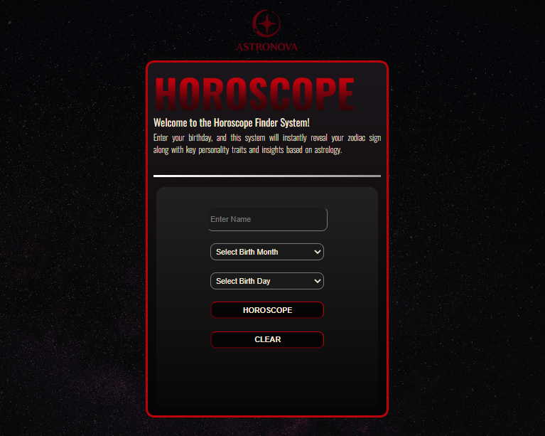
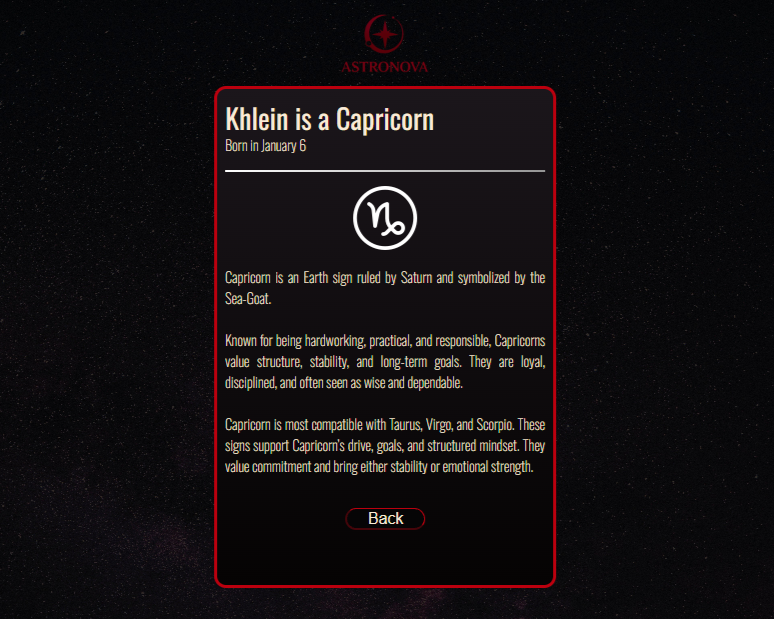

# ASTRONOVA

AstroNova is a modern, responsive, and creative PHP-based website that allows users to explore the mysteries of astrology. By simply entering a birthdate, users can instantly discover their zodiac sign, gain insights into their personality, and explore compatibility with other signs. With its clean design and galaxy-inspired maroon theme, AstroNova delivers both functionality and aesthetic appeal, making it an engaging tool for anyone interested in self-discovery and astrology.  

## Features
- **Zodiac Finder** - Input your birthdate to identify your zodiac sign. 
- **Personality Insights** – Learn about the key traits and characteristics of your sign.  
- **Compatibility Checker** – Explore how well your sign matches with others. 
- **Responsive Layout** – Optimized for desktops, tablets, and mobile devices.

